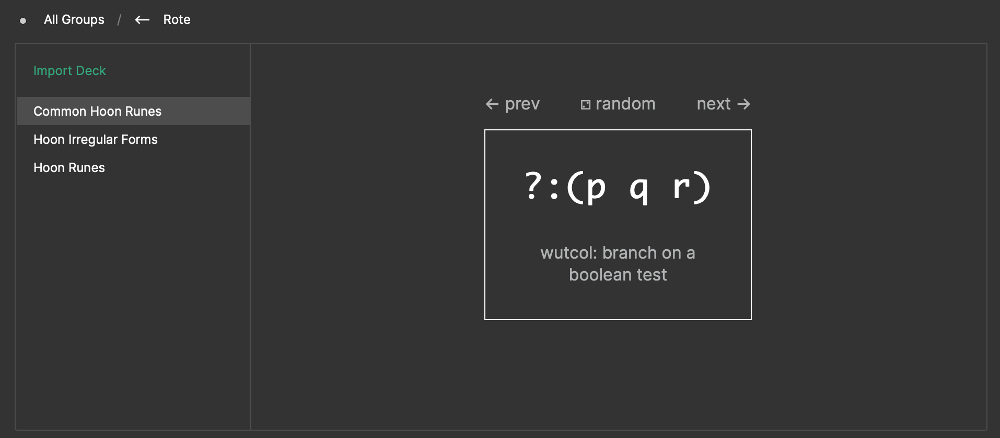

# rote

A flashcard app for Landscape.

## Installation

First, boot your ship, and make sure you've mounted its pier by running `|mount %` in Dojo.

Then, clone this repo, and create an `.urbitrc` file in the repo directory with the following contents:

```js
module.exports = {
  URBIT_PIERS: [
    "/path/to/ship/home",
  ]
};
```

Then run these commands from the repo root:

```
yarn
yarn run build
```

Finally, in your ship's Dojo, run:

```
|commit %home
|start %rote
```

You should then be able to see the `rote` tile on your Landscape home.

For Hoon practice, try importing these decks!

```
~watter-parter/hoon-runes
~watter-parter/common-hoon-runes
~watter-parter/hoon-irregular-forms
```

(Alternatively, you can copy the `decks` directory into your pier.)

## Walkthrough

This repository also functions as a walkthrough for creating your own Gall
app! Open up [rote.hoon](urbit/app/rote.hoon) and read the whole thing.

## Screenshot


